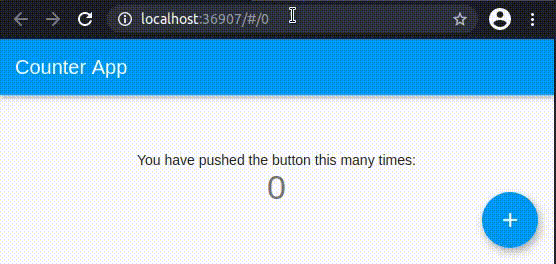

# Simple Url Handler

Do you want a normal web app without compromising the ease of use of Flutter?
This package is here for you. You will be able to:
* Update the url according to your app state
* Have the forward and backward buttons working out of the box
* Get a manually entered url to update your app state



## Getting Started
Add this to your package's pubspec.yaml file:
```
dependencies:
    simple_url_handle: ^0.0.1
```

## Usage
Import the package with
```
import 'package:simple_url_handler/simple_url_handler.dart';
```

To use it, use the `SimpleUrlHandler` class:
```
SimpleUrlHandler(
    urlToAppState: (BuildContext context, RouteInformation routeInformation) {
        // This is called when a user enters a url or presses the forward/backward
        // button. You should update your app state according to the RouteInformation.
    },
    appStateToUrl: () {
        // This is called when the url should be updated
        // You must return a RouteInformation
    },
    child: YourAppWidget(),
);
```

### Update the url according to your app state
If your app state changes and you need the url to update, just call  
`SimpleUrlNotifier.of(context).notify();` which will trigger a call to
`appStateToUrl`.

## Limitations
Mixing navigator 2.0 and navigator 1.0 is not a good idea.

What this means is that, since `MaterialApp` uses navigator 1.0, **you can't
use `MaterialApp`**. Instead, use the `SimpleUrlHandler` as you material app, since
it takes the same arguments and creates a `MaterialApp` for your.
This issue is being track in [this issue](https://github.com/flutter/flutter/issues/72093).

This also means that you have to use navigator 2.0 to handle routing. If you think
this is difficult check my medium article: [Flutter Navigator 2.0 for mobile dev: 101](https://lucasdelsol01.medium.com/flutter-navigator-2-0-101-for-mobile-dev-5094566613f6)  
to see how simple it is.

## Remark

This packages only handles the url, so it should be useless for platform other than the web.
However this should be safe to use (although useless).